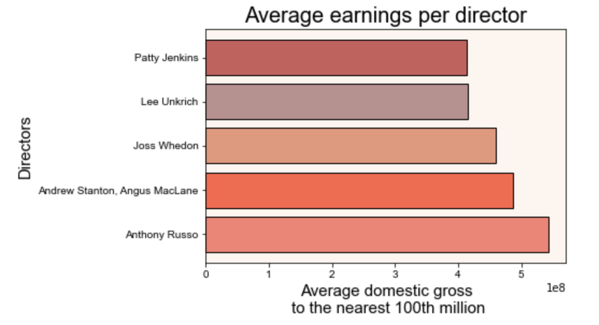

# Microsoft Insights

**Authors**: Edgar Barron

## Overview

This project analyzes the requirements, factors and strategies a business such as Microsoft must consider when trying to establish their presence in the Box Office industry. When analysing the data the movie industry has acquired throughout the years, it was found that multiple factors come into play to make a high grossing film including its genre, movie director, and choosing a production company.

## Business Problem

When entering the movie industry, Microsoft can enter with the right foot in if they choose the right movie director, genre of movie, and if they so desire partner with a production company to produce succesful movies. Doing so will allow Microsoft to keep producing movies and become a strong competitor in the movie industry.

## Data

There are various reliable sources that detail everyhting we would need to know about the movie industry. Sites such as [IMDB](https://www.imdb.com/), [Box Office Mojo](https://www.boxofficemojo.com/), [Rotten Tomatoes](https://www.rottentomatoes.com/), [TMDB](https://www.themoviedb.org/), and [The-Numbers](https://www.the-numbers.com/). The data within the files from the website listed contained diverse information such as the date the movie was released, its associated cast, the genre and characteristics of the film, as well as the gross of the film just to name of few.


## Methods

For this project the main sources of data used were from [Rotten Tomatoes](./data/zippedData/rotten_tomatoes_movies.csv.gz) and [Box Office Mojo](./data/zippedData/bom.movie_gross.csv.gz). Since the main problem of the project was to figure out succesful strategies that Microsoft can use to enter the Movie Industry succesfully, I concentrated my findings in the what was the highest grossing of a particular factors. Furthermore, since the movie industry has grown exponetially just this past decade, I concentrated my data in movies released in the year 2010 to present day.


## Results

Based on the Exploratory analysis of the data provided I found that the most popular Genre of Movies and the one that generated the most total gross were Action & Adventure. In fact, as shown in Visual 1, there was alot of overlap between the Action genre and other genres. Based on this finding, it is clear that the Action & Adventure genre is a very popular genre and is a genre that audiences are compelled to when deciding what movie they want to see.

### Visual 1


Next, I found that the highest grossing director, as found on Visual 2, was Anthony Russo. To have succesful fi
lms it is important that the content produced is high quality. A director is a key role in the quality of the film's production, which in turn contributes to the film's success and earns higher gross. However, as noted in Visual 3, althugh there was very weak positive correlation between the rating out of 100 and the gross of a film, the 5 directors have a relatively high rating with a median of 93. 

### Visual 2


### Visual 3


I tried to look at other factors that could contribute to a higher grossing film such as runtime of a movie. As per Visual 4, there was a positive correlation between runtime and dometic gross, but not strong enough to consider as a "causation" factor.

However, I did learn that most movies stayed between the 103 minute and the 165 minute mark and that the average runtime was 136 minutes. These are important numbers that the production company can keep in mind to provide a standard runtime movie.

### Visual 4


Finally, I also looked into the the historical data on movie prodcution companies as well as movie studios and the amount of movies produced within the 10 year period -from 2010 to present day. I looked into the movie studios that generated the most gross and looked into the top production companies that generated the most gross per movie produced.

As per Visual 5, the top 3 production companies were Disney/Pixar, MGM, and Paramount. This is significant because their average gross Per Movie is along the highest and it shows the prodcution companies that Microsoft can consider partnering with to poduce the movie that they desire instead of cerating their own studio from scratch. Additionally in the [Notebook](./Microsoft-Insights.ipynb) it is shown that the production companies produced at most 4 movies within the 10 year period and they still had a high average gross.  

### Visual 5


## Conclusions

The analysis of the Results leads to 3 recommendations for Microsoft:
- **Choose a good director that will produce quality content and have an average standard runtime
- **Consider choosing some of the top production companies that have shown they can produce movies that are high grossing
- **Choose a high grossing genre that has been shown to be high grossing.

## Next Steps

To get a more complete picture of the Box Office industry, further analysis of the following could help provide a more personalized strategy:

- Analyze the most popular ratings ('G','PG','PG-13','R') and which rating in average brings in the most gross
- Analyze the most effective budget that should be given to different movie genres
- Analyze effective marketing strategies that help a movie be succesful and high grossing in the box office

***
Questions to consider:
* What would you recommend the business do as a result of this work?
* What are some reasons why your analysis might not fully solve the business problem?
* What else could you do in the future to improve this project?
***

## For More Information

Please review our full analysis in [our Jupyter Notebook](./Microsoft-Insights.ipynb) or [my presentation](./DS_Project_Presentation.pdf).
For any additional questions, please contact [me](mailto:edgarraul98@icloud.com).

## Repository Structure

Describe the structure of your repository and its contents, for example:

```
├── README.md                           <- The top-level README for reviewers of this project
├── Microsoft-Insights.ipynb            <- Narrative documentation of analysis in Jupyter notebook
├── DS_Project_Presentation             <- PDF version of project presentation
├── data                                <- Both sourced externally and generated from code
└── project_images                      <- Both sourced externally and generated from code
```
